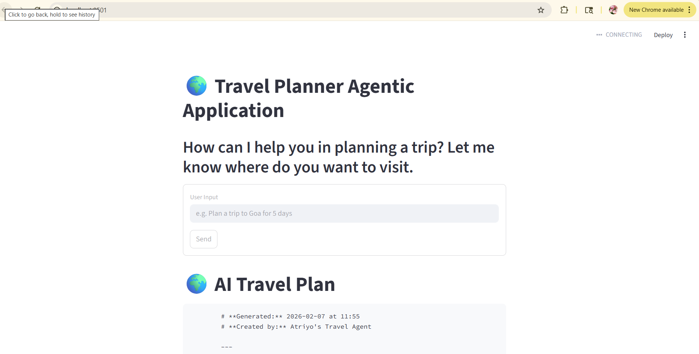
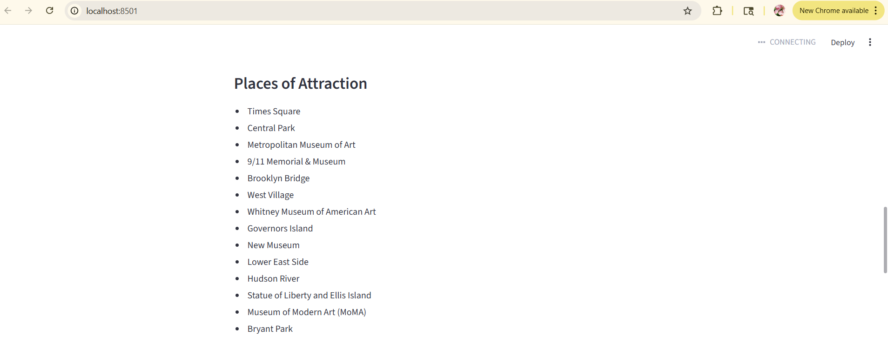
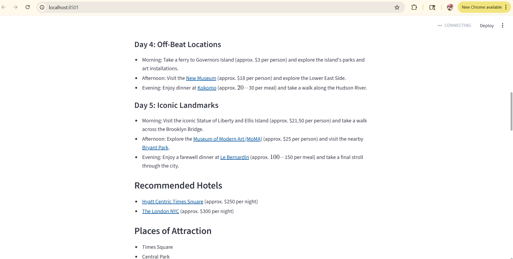
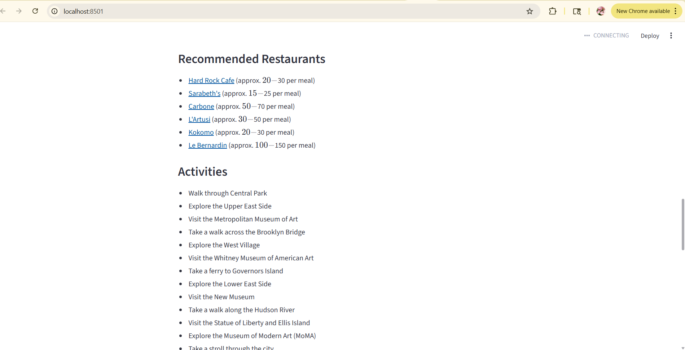
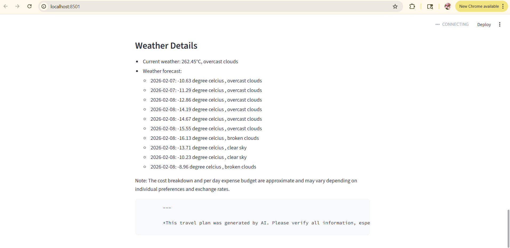

# 🌍 Travel Planner Agentic Application

An **Agentic AI-powered travel planning application** that generates a **complete end-to-end travel itinerary** using multiple intelligent tools such as weather forecasting, place search, expense calculation, and currency conversion.

This project demonstrates how **Agentic AI systems** can autonomously reason, call tools, and generate structured real-world outputs using **LangGraph + LangChain**.

---

## 🚀 Features

- 🧠 Agentic AI workflow using LangGraph
- 🗺️ Day-wise travel itinerary generation
- 🏨 Hotel recommendations
- 🍽️ Restaurant suggestions
- 📍 Places & attractions
- 🌦️ Real-time weather & forecast
- 💰 Detailed cost estimation
- 🚕 Transportation recommendations
- 💬 Natural language user input
- 🖥️ Interactive Streamlit UI

---

## 🧱 Architecture Overview

The system is built using an **agent + tools architecture**:

- LLM Agent (Groq)
- Weather Tool (OpenWeatherMap API)
- Place Search Tool (Google Places API, Foursquare API)
- Expense Calculator Tool
- Currency Converter Tool (Exchange Rate API)
- Web Search Tool (Tavily API)
- LangGraph workflow orchestration

The agent dynamically decides which tools to invoke based on user intent.

---

## 🖥️ Application UI
Below are real-time outputs generated by the Travel Planner Agentic Application during live execution.
---

### 🔍 Trip Search & User Input


This screen allows users to enter natural language queries such as  
*“Plan a trip to New York for 5 days”*.

---

### 🗺️ Places to Visit


AI-generated list of must-visit attractions, landmarks, and experiences tailored to the destination.

---

### 🏨 Hotel Recommendations


Curated hotel suggestions with estimated pricing based on location and trip duration.

---

### 🍽️ Restaurants & Food Options


Popular restaurants and dining recommendations generated using location intelligence.

---

### 🚕 Transportation Options


Suggested transportation modes including flights, taxis, public transport, and walking routes.

---

### 🌦️ Weather Details


Current weather and multi-day forecast for the destination to help travelers plan accordingly.


## use this command from your virtual env
```C:\Users\sunny\AI_Trip_Planner\env\Scripts\activate.bat```


```
streamlit run streamlit_app.py
```

```
uvicorn main:app --reload --port 8000
```